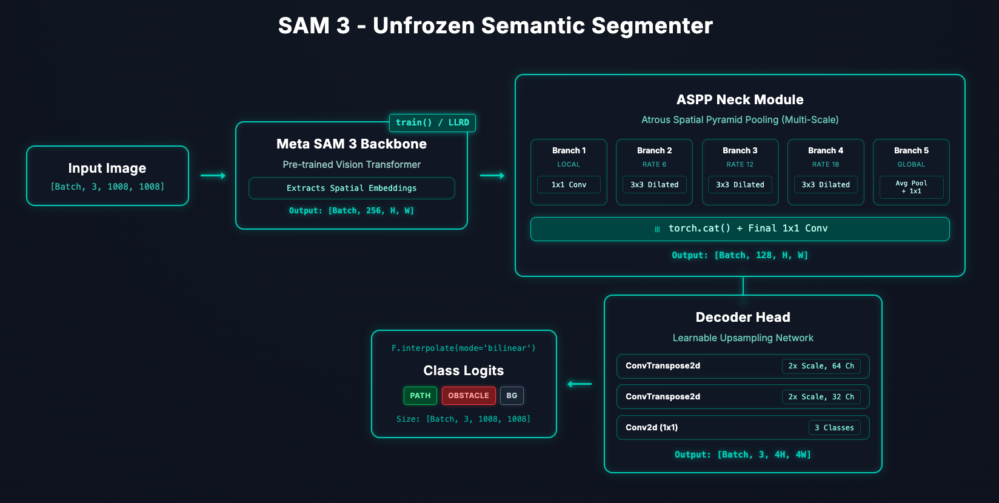
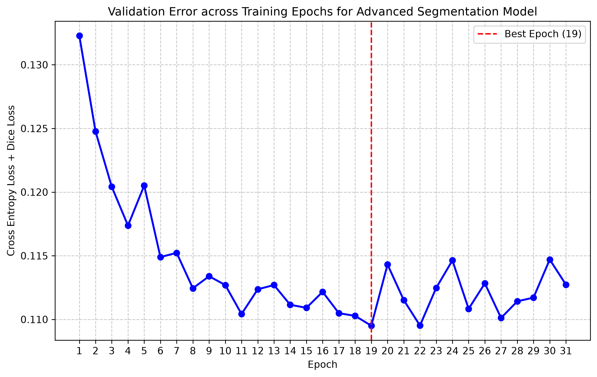
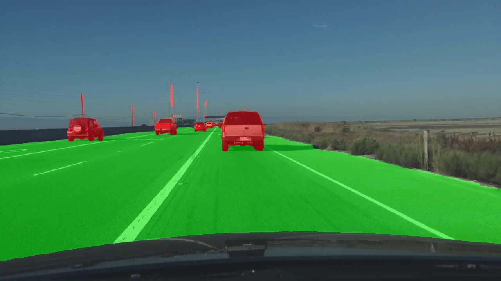
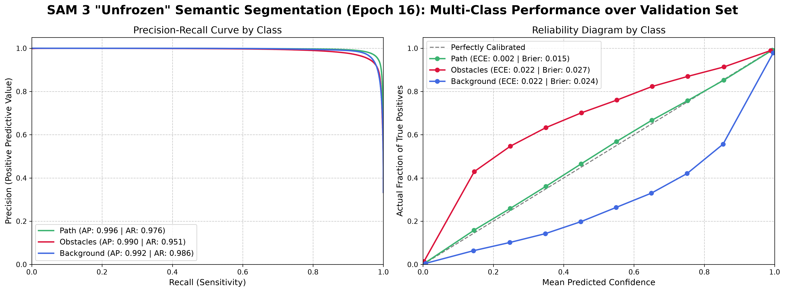
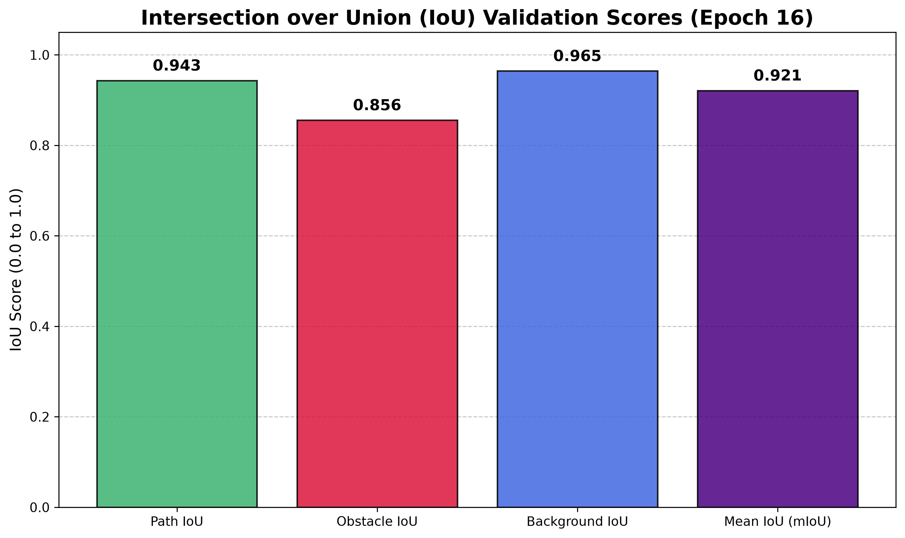

# Segment Anything Model 3 - Unfrozen Semantic Segmenter (SAM3-U-TierSS)


**Author:** Mychel Segrini

**Affiliation:** Williams College and LASIGE, University of Lisbon

This repository contains a model for semantic segmentation of images for three classes: path, obstacle, and background. It has code for fine-tuning the backbone of Meta's [SAM3](https://github.com/facebookresearch/sam3/tree/main) model, and a customized set of head and neck for semantic segmentation. The model (backbone + head + neck) was trained on a mix of the BDD100K dataset by Berkeley DeepDrive, the Mapillary Vistas Dataset, and the Cityscapes Dataset. You may customize the model even more and use the scripts in this repository as modules for assistint in the training. This repo also has scripts for selecting the epoch with best generalization, and for measuring the calibration of the model with metrics such as Average Precision, Expected Calibration Error, and the Brier Score.


## Installation

For this installation, you will need to have `pip` and `python`. Go to your preferred directory and clone this repository. Use your preferred virtual environment. If you use Conda, paste the following to create and activate a virtual environment:

```bash
conda create --name sam3 python=3.12 &&
conda activate sam3
```

Then, to get the required packages, paste the following:

```bash
pip install torch torchvision &&
pip install -r requirements.txt
```

For using SAM3, clone the [repo](https://github.com/facebookresearch/sam3.git) follow the instructions from the repo for getting the model in Hugging Face:

```bash
git clone https://github.com/facebookresearch/sam3.git
```

Download `sam3.pt` from the Hugging Face repo once you get access to it. Create a `.env` file and configure the following environment variables. Modify them if you are using another model:

```python
ROOT_PATH = "/path/to/root/directory" 
VALIDATION_RELATIVE_PATH = "relative/path/to/validation/directory"
TEST_RELATIVE_PATH = "relative/path/to/test/directory"
WEIGHTS_RELATIVE_PATH = "relative/path/to/weights/directory"
SAM3_RELATIVE_PATH = "relative/path/to/model/directory"

DATA_RELATIVE_PATH = "relative/path/to/plots/csvs/directory"
BDD_RELATIVE_PATH = "bdd100k"
CITYSCAPES_RELATIVE_PATH = "cityscapes"
MAPILLARY_RELATIVE_PATH = "mapillary"
```

For `ROOT_PATH` and `VALIDATION_RELATIVE_PATH`, examples would be:

```python
ROOT_PATH = "/Users/username/lasige" 
VALIDATION_RELATIVE_PATH = "dataset/val"
```

Do any modifications to the code for enhancing the head or neck, or the fine-tuning of the backbone.

## Usage

The model is currently structured like this:



For deeper information on each of the following scripts, read their comments.

### 1. `segmenter.py`

It defines SAM3-U-TierSS by taking SAM3's backbone and defining the head, the neck, and a specialized loss (Focal Loss + Dice Loss). Contains classes ASPP, SAM3Segmenter, and SegmentationLoss.


### 2. `dataset.py`

It defines a custom PyTorch Dataset for loading and processing the each of the semantic segmentation datasets (BDD100K, Mapillary, and Cityscapes). It also has a Dataset for adding custom images for oversampling. These datasets handles the loading of raw images and their corresponding mask files. It performs necessary resizing to 1008x1008 (required by SAM 3), normalizes the images, and critically remaps the original classes down to 3 simplified categories: Path (0), Obstacle (1), and Background (2). It contains the classes BDD100KSemanticDataset, CityscapesSemanticDataset, MapillarySemanticDataset, CustomLocalDataset (for oversampling), and a helper function _process_image_and_mask.

### 3. `train.py`

It sets up the hardware, loads the datasets and concatenates them, loads the model architecture, initializes the optimizer and loss function with specific class weights, and runs the training loop over the specified number of epochs. Finally, it generates and saves a plot of the training loss.

Run it as:

```bash
python train.py
```

If you have a big batch of images, it is preferable to have a GPU. The code will recognize easily if you have an NVIDIA GPU. The output graph looks like this:



### 4. `evaluate_epochs.py`

It runs inference on a folder of images with a folder of .pt files, getting the validation error across different epochs of training. It plots the validation error across epochs, selecting the model with the lowest validation error.

Run it as:

```bash
python evaluate_epochs.py
```
The output looks like this:


### 5. `process_folder.py`
It runs semantic segmentation inference on an entire folder of images and exports multiple mask formats alongside JSON metadata for downstream processing.

Run it as:

```bash
python process_folder.py
```

Three different mask formats are in the output: colored, indexed, and a blend of the colored and the original image. Here is an example of a blended mask:



### 6. `measure.py`

It takes one of the epochs, a .pt file of your choice, and runs it on a batch of images and compares the results to a set of corresponding labels. It generates two .csv files: one with a pixel-level registration of true class and probabilities, another with the IoUs accross classes and the average IoU.

### 7. `plot.py`

It generates a plot from a .csv file with many metrics, and another plot with the IoUs in bars. See examples below:




## License
    Copyright [2026] [Mychel Lopes Segrini]

    Licensed under the Apache License, Version 2.0 (the "License");
    you may not use this file except in compliance with the License.
    You may obtain a copy of the License at

        http://www.apache.org/licenses/LICENSE-2.0

    Unless required by applicable law or agreed to in writing, software
    distributed under the License is distributed on an "AS IS" BASIS,
    WITHOUT WARRANTIES OR CONDITIONS OF ANY KIND, either express or implied.
    See the License for the specific language governing permissions and
    limitations under the License.
